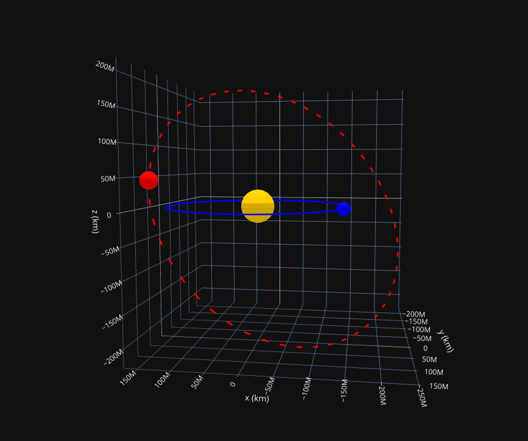

# Neotuitive

A Python library for visualizing and analyzing Near-Earth Objects (NEOs) risk list, using data from ESA's Near-Earth Object Coordination Centre.

## Features

- Fetch and store NEO data from ESA's risk list (https://neo.ssa.esa.int/risk-list) using their API (https://neo.ssa.esa.int/computer-access)
- Visualize NEO orbits in 2D and 3D
- Intuitions about NEO which are in the risk list and their potential impact on Earth
- Command-line interface for quick NEO searches

## Quick Start

```python
from neotuitive.api.handler import NeoRiskListAPI
from neotuitive.db.repository import NeoRiskListDB
from neotuitive.data import DataLoader
from neotuitive.service import Neo
from neotuitive.visual import Show
from datetime import datetime, timedelta

if __name__ == "__main__":
    # Initialize components
    api = NeoRiskListAPI()
    db = NeoRiskListDB("near_earth_objects.db")
    loader = DataLoader(api, db)

    # Load data if needed - Stores them in sqlite database
    loader.initialize_storage()

    # Create service and visualization instance
    neo_service = Neo(db)
    show = Show(neo_service)

    # Example - Plot specific NEO orbit in 3D
    neo = neo_service.from_name("2024YR4")
    if neo:
        show.orbit_3D(neo.name, datetime.now())
```



## Command Line Interface

Search for NEOs directly from the command line:

```bash
# Get page 2 with 20 results per page
python -m neotuitive.cli 2024 --page 2 --size 20

------------------------------------
Name: 2024GY5
Diameter: 10.0 meters
Velocity: 19.3 km/s
Impact Probability (max): 0.000001
Palermo Scale (max): -7.57
Torino Scale: 0.0

------------------------------------
Name: 2024GZ5
Diameter: 3.0 meters
Velocity: 11.8 km/s
Impact Probability (max): 0.000233
Palermo Scale (max): -6.52
Torino Scale: 0.0
